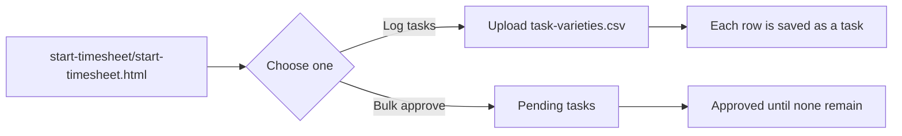
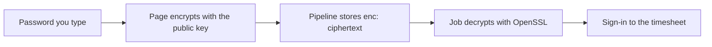

<div align="center">


# Timesheet simulations

**Start here.** Open [`start-timesheet/start-timesheet.html`](start-timesheet/start-timesheet.html) in your browser.

<p>
  <a href="start-timesheet/start-timesheet.html"></a>
</p>

Owned by the **QE Performance Team**

</div>

---

This page starts a check against the live timesheet at [timesheet.geidea.net](https://timesheet.geidea.net). You do not install tools. You choose what to run, enter a timesheet username and password, and click **Save and run**.

A run **changes the live timesheet**. Log tasks creates real entries. Bulk approve approves real pending tasks.

## Open the page

1. In this project, open **[start-timesheet/start-timesheet.html](start-timesheet/start-timesheet.html)**.
2. Open that file in a browser. Double-click it, or drag it into a browser window.
3. Choose a simulation, fill in the form, and click **Save and run**.

**Save and run** is the only step that starts a run. The page keeps your username and your last choice. It does not keep the password.

## Choose a simulation



| On the page | Who uses it | What you provide | What the run does |
|---|---|---|---|
| **Log tasks** | Someone entering time | Username, password, and `task-varieties.csv` | Signs in, opens Time Entry, and saves every row |
| **Bulk approve** | A manager | Username and password | Signs in, opens Team Approvals, and approves pending tasks until the list is empty |

Bulk approve hides the file upload. You only see it for **Log tasks**.

## Steps on the page

| | What you do |
|---|---|
| 1 | Open [`start-timesheet/start-timesheet.html`](start-timesheet/start-timesheet.html) |
| 2 | Choose **Log tasks** or **Bulk approve** |
| 3 | Enter the timesheet username and password |
| 4 | For **Log tasks**, upload `task-varieties.csv` |
| 5 | Click **Save and run** |
| 6 | Open the link that appears and wait until the run finishes |

If the run cannot start, the page shows the reason in red under the button. A successful start shows a link to the pipeline.

## Your password is encrypted

Your password is encrypted in the browser before it leaves the page. Other people using the same page cannot read it. The pipeline receives the encrypted value, not the password you typed.

The page does not store the password. It clears the field after you click **Save and run**. It only remembers your username and the simulation you chose.

The username is sent as the account name so the run knows who to sign in as. The password is the value that is encrypted.

### How it is implemented

| Piece | What it does |
|---|---|
| Page script in `start-timesheet/start-timesheet.html` | Encrypts the password before the request is sent |
| Algorithm | RSA-OAEP with a 2048-bit key, SHA-256, and MGF1-SHA-256 |
| Public key | Embedded in the page. It can only encrypt. It cannot decrypt. |
| Value sent | `enc:` followed by the ciphertext, in the `TIMESHEET_PASSWORD` field |
| `ci/prepare-run.sh` | Decrypts that value on the job, then writes the sign-in file |
| OpenSSL | The tool that decrypts. The command is `openssl pkeyutl` with OAEP and SHA-256 |
| Private key | Masked GitLab variable `TIMESHEET_PASSWORD_KEY`. It is not in the page and not in the repository |



Each click produces a different ciphertext for the same password. That is part of OAEP. A value that does not start with `enc:` is left unchanged, so a manual pipeline run can still pass a password directly.

## How to fill the task file

On the page, download **task-varieties.csv**. Leave the first row as it is. Also download the three reference files. Those lists come from the live Time Entry form.

| File | What it is for |
|---|---|
| `task-varieties.csv` | The tasks you want the run to save |
| `departments.csv` | Allowed values for **Department** |
| `countries.csv` | Allowed values for **Country** |
| `projects.csv` | Project **name** and **id** |

| Step | What to copy |
|---|---|
| 1 | **Department** from `departments.csv` |
| 2 | **Country** from `countries.csv` |
| 3 | Project **name** into **Project**, and its **id** into **ProjectId**, from `projects.csv` |
| 4 | Task name, description, date, and hours |
| 5 | Any number of rows. One task per row. Upload the file. The run logs each row. |

The columns, in order:

| Column | Meaning |
|---|---|
| Department | Name from `departments.csv` |
| Country | Name from `countries.csv` |
| Project | Name from `projects.csv` |
| ProjectId | The `id` on that same project row |
| Task Name | Title of the task |
| Details / Description | Longer note for the task |
| Date | Day of the work. `2026-10-01`, `01/10/2026`, `9/23/2026`, `23 Sep 2026`, or the same value with a time. A slash date such as `01/10/2026` is day-first unless another row can only be month-first, such as `9/23/2026`. Sent as `YYYY-MM-DD` |
| Hours | Number of hours |

```csv
Department,Country,Project,ProjectId,Task Name,Details / Description,Date,Hours
Engineering,EGY,QE Automation & Performance Frameworks,484,Scenario design,Prepare the task log run,2026-09-28,1
```

Department and Country are labels so the file is easy to read. The run posts the project id, task name, description, date, and hours.

## Reference lists stay current

Every hour, a scheduled run signs in to the live timesheet and refreshes:

- `departments.csv`
- `countries.csv`
- `projects.csv`

It updates both copies:

| Copy | Used by |
|---|---|
| `src/test/resources/data/timesheet/` | The simulations |
| `start-timesheet/start-timesheet.html` | The downloads on the page |

If nothing changed, it does not commit. If a list changed, it commits the new files and pushes them. Pull that branch to see the files on your computer. The next publish of the page serves the new downloads.

The same run uploads `start-timesheet/start-timesheet.html` into the shared folder **Start Time Sheet** on `mydrive.geidea.net` and replaces `start-timesheet.html` when that file is already there. That host is SharePoint on the company network and accepts a Windows sign-in. The upload runs when `ONEDRIVE_USERNAME` and `ONEDRIVE_PASSWORD` are set. If SharePoint cannot be reached, the job still refreshes and commits the lists.

## After the run

Open the link from the page, then open the job. Download:

| File | What it shows |
|---|---|
| Report | How many requests passed, and how fast they were |
| Log | Each request and response |

Both stay available for 14 days.

A healthy log-tasks run has one sign-in, then one entry for every row in the file. The end of the log lists each task as logged or not logged. A duplicate is listed as not logged, and the run stops after that list. A wrong username or password fails at sign-in with that reason, before any task is sent. A healthy bulk-approve run lists pending tasks, approves them in batches, and stops when none remain. If the pending list is already empty, the run finishes without an approve request.

## Notes for the QE Performance Team

Local runs need Java 21 and Maven. Each run uses one virtual user.

| Page choice | Command |
|---|---|
| Log tasks | `mvn -Dgatling.simulationClass=simulations.timesheet.tasks.EmployeeTaskLogSimulation gatling:test` |
| Bulk approve | `mvn -Dgatling.simulationClass=simulations.timesheet.approval.ManagerBulkApproveSimulation gatling:test` |

A local sign-in reads `src/test/resources/data/timesheet/users.csv`. Do not commit real passwords. On the page, the username and password are sent only for that run.

| Topic | Detail |
|---|---|
| Target | `https://timesheet.geidea.net` |
| Log tasks path | `POST /TimesheetEntry` |
| Approvals path | `GET` and `POST /TimesheetApproval` |
| Pending page size | 100 tasks at a time, then the next page, until none remain |
| Retries | 10 attempts, with a 2 second pause. Override with `-Dretries` and `-DretryPauseSeconds` |
| Reports | `reports/<simulation>-<timestamp>/index.html` |
| Request logs | `logs/<simulation>-<timestamp>.log` |
| Lookup refresh | GitHub Actions schedule, every hour |
| Page publish | A push to `master` or `main` publishes `start-timesheet/start-timesheet.html`, including the three lookup lists |
| Manual run | Actions → Timesheet → Run workflow. Choose task-log or bulk-approve |

Failed requests are printed on the console. To print every request there as well, add `-Dgatling.enterprise.console.level=TRACE`.
